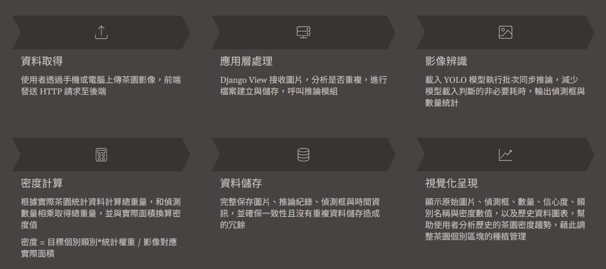
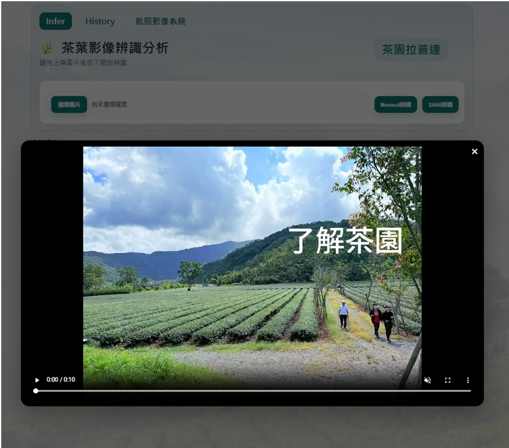
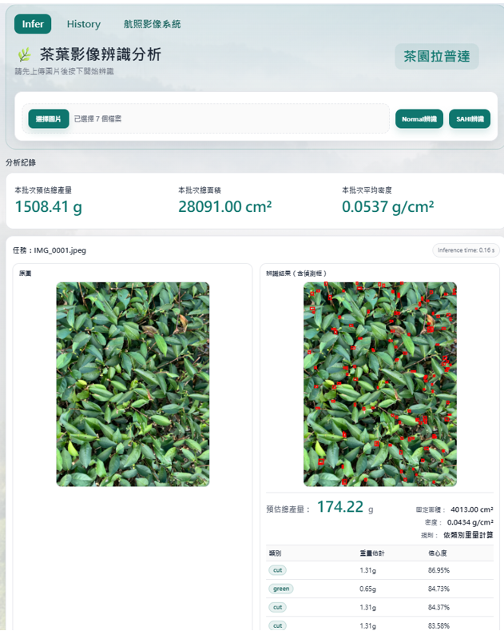
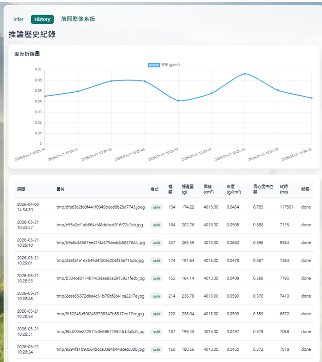

# 茶園拉普達

## 專案介紹

使用 Django + YOLO 建立的茶葉影像辨識系統。

使用者可上傳茶葉照片，系統會進行物件偵測，計算不同茶葉類別的重量，並保存歷史紀錄供後續查詢。

---

## 系統架構圖

```text
Browser(user)
   ↓
Nginx
   ↓
Django
├── YOLOv8 (Normal)
├── SAHI
└── SQLite
```
---


---
## 系統流程圖

### 流程說明


1. 使用者透過手機或電腦上傳茶園影像，並發送請求至 Django 系統。

2. Django 接收請求後，先計算影像 SHA-256 雜湊值，檢查是否存在相同圖片：
   - 若已存在，直接回傳歷史推論結果。
   - 若不存在，則建立資料紀錄並儲存原始影像。

3. 系統載入 YOLO / SAHI 模型執行同步推論，取得茶葉目標的偵測框、類別與數量資訊。

4. 根據茶園實測統計資料計算總重量：

總重量 = 偵測數量 × 單位重量
密度 = 總重量 ÷ 茶園面積

5. 將推論結果儲存至資料庫，包括：
- 原始圖片
- 推論後圖片
- 偵測框資訊
- 重量與密度統計
- 推論時間與模型參數

6. 系統讀取歷史紀錄並以圖表呈現密度變化趨勢，協助使用者分析不同區域的生長狀況，作為後續茶園管理與採收決策參考。 

---

## 技術工具

### Tech Stack

* Python 3.13
* Django 4.2
* YOLOv8
* SAHI
* SQLite
* Nginx
* Waitress

---

## 功能

### Features

### AI 功能

* 單張影像辨識
* SAHI 切圖辨識
* 歷史紀錄查詢
* 推論結果儲存

### Nginx 功能

* Reverse Proxy
* HTTPS
* Basic Auth
* Rate Limiting
* Gzip Compression

---

## 系統畫面

### 首頁


### 推論結果



### 歷史紀錄



---

## 資料庫設計

### ERD

（放 ERD 圖）

### 資料表說明

#### Photo
* 儲存原始圖片資訊
* 儲存圖片 SHA256 雜湊值
* 避免重複圖片重複儲存

#### InferenceRun
* 儲存每次推論紀錄
* 支援 Normal 與 SAHI 模式
* 記錄推論時間、信心值與總重量

#### Detection
* 儲存每個偵測框資訊
* 包含類別、信心值與 Bounding Box 座標

---

## YOLO 推論流程

```text
Upload Image
      ↓
Django API
      ↓
YOLO Predict
      ↓
計算重量
      ↓
存入 Database
      ↓
回傳結果
```

---

## 效能測試

### 測試圖片

* Resolution：4284 × 5712

### 推論時間

#### Normal

約 40 ~ 80 秒

#### SAHI

約 100 ~ 220 秒

### 結論

SAHI 雖然能提升大型圖片的辨識效果，但會增加推論時間。

---

## 遇到的問題

### 1. 大圖推論耗時過長

#### 問題

原始圖片解析度約 4284 × 5712，直接推論時耗時較長。

#### 解法

導入 SAHI 將圖片切分成多個區塊後再進行推論。

#### 結果

辨識率提升，但推論時間由 40 ~ 80 秒增加至 100 ~ 220 秒。

---

### 2. 管理介面安全性不足

#### 問題

Django Admin 可直接從網路存取。

#### 解法

利用 Nginx Basic Auth 增加額外驗證層。

#### 結果

降低未授權存取風險。


## 未來優化

### Future Improvements

* MySQL
* Docker
* Batch Processing
* Celery 非同步推論
* Redis Queue
